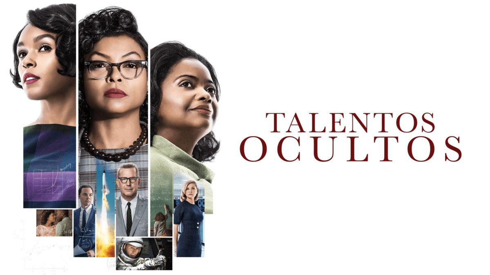

# Lo que nos enseña la película Talentos Ocultos (Hidden Figures)

Recientemente, tuve la oportunidad de ver junto a mi madre una conmovedora historia que narra el papel fundamental de las mujeres en el avance de la humanidad hacia el espacio.

## Sesgos, prejuicios y racismo. 

Esta historia posee una riqueza de elementos destacables. Desde el comienzo, se ponen en evidencia los sesgos y el racismo de esa época, con el personaje de Jim Parsons (quien interpreta a Paul Stafford y quien curiosamente interpreta a Sheldon Cooper en **The Big Bang Theory** otra historia sobre física, ciencia y el espacio) muestra sesgos hacia el personaje de Katherine Globe (Taraji P. Henson) primero con una actitud de **"¿Porque debo de compartir mis cálculos con alguien si son perfectos?"** ese es un ejemplo de un sesgo, un prejuicio ejercido hacia alguien que influyo en sus decisiones. 

En cambio, cuando Katherine toma del café y todos en la oficina le crean espacio de café con una cafetera solo para ella, porque les da miedo o asco tocar la misma taza que ella es un ejemplo de racismo, ya que es una forma extrema de sesgos, ya que implica una creencia negativa que se presenta en forma de discriminación. 

## Solo baños para personas. 

Otro ejemplo, de racismo que vemos en la película es la existencia de espacios separados para personas de raza negra, situados a gran distancia de sus áreas de trabajo, requiriendo largos desplazamientos hasta los baños. No obstante, llegó un momento clave cuando el director de la NASA eliminó la señalización diferenciada en los baños, declarando que en la NASA solo hay baños, independientemente de la raza.

## Baños en las compañías japonesas. 

En otro video que aborda el emprendimiento a la japonesa, se destaca que en las empresas de Japón no se diferencian los baños para ejecutivos, ya que todos los desechos humanos son iguales. Pero ese es tema de otro análisis. 

## Las primeras mujeres ingenieras. 

Otro asunto de importancia se centra en la resistencia que enfrentan las mujeres de raza negra que aspiran a convertirse en ingenieras; los requisitos cambian constantemente, lo que prácticamente vuelve inalcanzable su objetivo. 
Hasta que Mary Jackson (interpretada por Janelle Monáe) decide luchar por su derecho a la educación, expresando que los planes de estudio no deben ser diseñados en función de una raza específica.

## Las mujeres inventaron la programación. 

Mi parte favorita de la película muestra cómo el personaje de Dorothy Vaughan (interpretado por Octavia Spencer) aprende Fortran, uno de los primeros lenguajes de programación utilizados en las computadoras IBM, y comparte su conocimiento con las demás mujeres. Dorothy se convierte en la experta y supervisa la instalación de la IBM. En un momento destacado, ella exige que todas las mujeres de su equipo sean incluidas en un trabajo técnico, lo cual las lleva a marchar hacia la NASA para manejar la IBM. Este episodio contribuye a consolidar la afirmación popular de que la programación fue inventada por mujeres.

## Te invito a verla.

¿Que estas esperando para ver esta película? y, al igual que yo, quedar fascinado por el mensaje que nos brinda

## Sobre el autor.

 

<a class="badge-base__link LI-simple-link" href="https://mx.linkedin.com/in/fernando-sanchez-mejia?trk=profile-badge">Fernando Sanchez Mejia</a>

